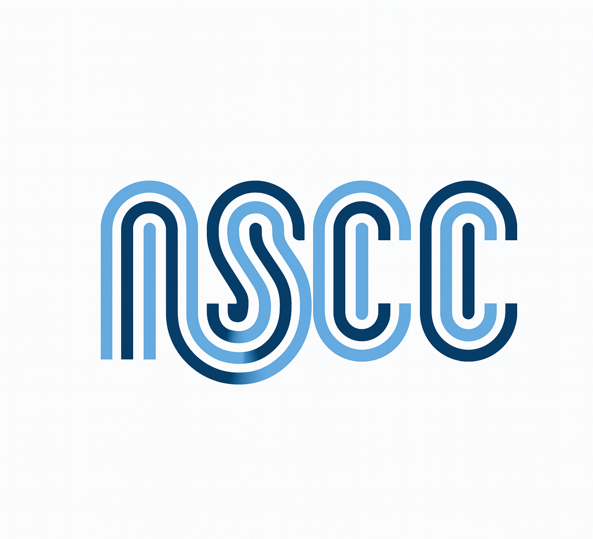

<p align="center">
  
</p>

<h1 align="center">Bragg Peak Simulation</h1>

<p align="center">
  <samp>Natural Sciences Computing Club · UNC Chapel Hill</samp>
</p>

<p align="center">
  
  
  
</p>

<br>

<p align="center">
This project simulates the <b>Bragg Peak</b> phenomenon, the characteristic spike in energy deposition<br>
that occurs when a proton beam travels through matter. Understanding the Bragg Peak is central to<br>
<b>proton therapy</b>, a form of radiation treatment that targets tumors with high precision<br>
while minimizing damage to surrounding tissue.
</p>

<p align="center">
Our goal is to build progressively more realistic simulations starting from a simple 1D model<br>
and working toward physically accurate representations of proton transport through layered human tissue.
</p>

<br>

---

<br>

<h2 align="center">Current State</h2>

<p align="center">
  
  <samp>Braggs_Peak.py</samp>
</p>

The initial simulation models a 1D Bragg Peak in liquid water using NIST PSTAR stopping power data.

<table>
<tr><td width="40" align="center"><b>1</b></td><td>Loads proton stopping power and CSDA range data from a CSV file</td></tr>
<tr><td align="center"><b>2</b></td><td>Constructs smooth log-log interpolations over the data</td></tr>
<tr><td align="center"><b>3</b></td><td>Steps a proton through water, reducing its energy at each depth using the linear stopping power</td></tr>
<tr><td align="center"><b>4</b></td><td>Computes an ideal dose curve and applies Gaussian broadening to approximate real beam behavior</td></tr>
<tr><td align="center"><b>5</b></td><td>Plots the relative dose vs. depth and proton energy vs. depth</td></tr>
</table>

<br>

<details>
<summary><b>V1 Assumptions</b></summary>
<br>
<table>
<tr><td></td><td>Straight proton path (no scattering)</td></tr>
<tr><td></td><td>No Coulomb scattering</td></tr>
<tr><td></td><td>Continuous slowing down approximation (CSDA)</td></tr>
<tr><td></td><td>Homogeneous medium</td></tr>
<tr><td></td><td>Monoenergetic protons</td></tr>
<tr><td></td><td>Dose proportional to deposited energy</td></tr>
</table>
</details>

<br>

---

<br>

<h2 align="center">V2 Goals</h2>

<p align="center">
We are actively working to reduce these assumptions.
</p>

<br>

<table>
<tr>
<td align="center" width="200"><br><br><sub>How does the peak change across different materials?</sub></td>
<td align="center" width="200"><br><br><sub>Stacked tissue layers with real thickness and density data</sub></td>
<td align="center" width="200"><br><br><sub>Stochastic scattering to replace the straight-line CSDA walk</sub></td>
</tr>
<tr>
<td align="center"><br><br><sub>Modeling realistic energy distributions from proton beam sources</sub></td>
<td align="center"><br><br><sub>Deformable mesh with skin-like elastic properties</sub></td>
<td align="center"></td>
</tr>
</table>

<br>

<p align="center">
  <a href="https://github.com/Natural-Sciences-Computing-Club/Bragg-Peak/issues/1">
    
  </a>
</p>

<br>

---

<br>

<h2 align="center">Getting Started</h2>

The simulation requires a CSV file containing NIST PSTAR data for protons in liquid water. The CSV should have three columns: kinetic energy (MeV), total stopping power (MeV cm²/g), and CSDA range (g/cm²). You can generate this data from the [NIST PSTAR database](https://physics.nist.gov/PhysRefData/Star/Text/PSTAR.html).

Update the `CSV_FILE` path in `Braggs_Peak.py` to point to your local PSTAR data file, then run:

```bash
python Braggs_Peak.py
```

<br>

---

<br>

<h2 align="center">Contributing</h2>

<table>
<tr><td><kbd>1</kbd></td><td>Check the <a href="https://github.com/Natural-Sciences-Computing-Club/Bragg-Peak/issues">open issues</a> for available tasks</td></tr>
<tr><td><kbd>2</kbd></td><td>Create your own branch from <code>main</code></td></tr>
<tr><td><kbd>3</kbd></td><td>Investigate your question and build your implementation</td></tr>
<tr><td><kbd>4</kbd></td><td>Commit your work to your branch</td></tr>
<tr><td><kbd>5</kbd></td><td>Open a pull request when ready for review</td></tr>
</table>

<br>

<p align="center">
If you have any trouble or questions, reach out to us on Discord.
</p>

<br>

---

<p align="center">
  <samp>Natural Sciences Computing Club · UNC Chapel Hill · 2026</samp>
</p>
